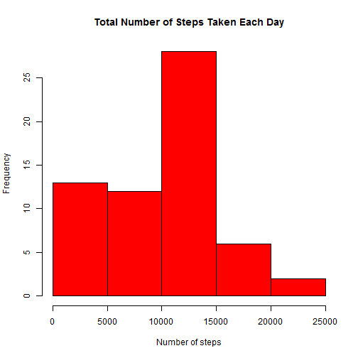
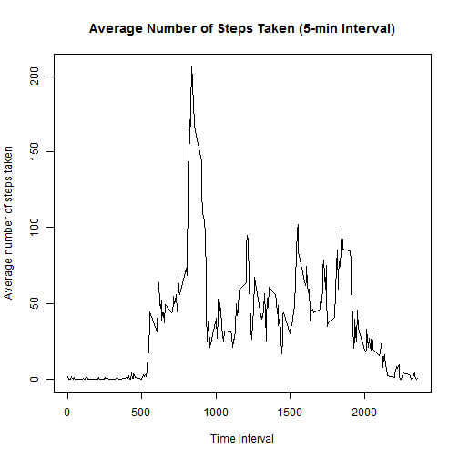
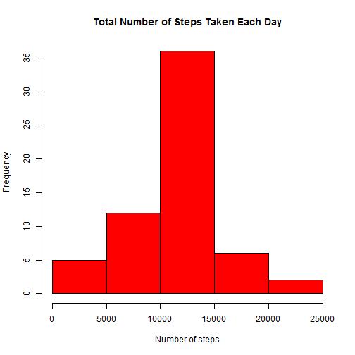
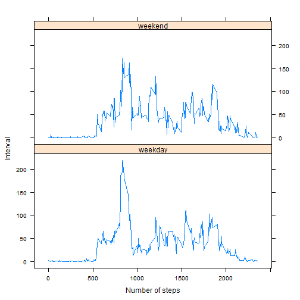

# Reproducible Research: Peer Assessment 1


## Loading and preprocessing the data

```r
# Download and unzip data for analysis
require(RCurl)  #required to use URL for download
setInternet2(TRUE)  #required to use URL for download
downloadurl <- "https://d396qusza40orc.cloudfront.net/repdata%2Fdata%2Factivity.zip"
if (!file.exists("activity.zip")) download.file(downloadurl, "activity.zip")
if (!file.exists("activity.csv")) unzip("activity.zip")

# Load the data using read.csv
fileData <- read.csv("activity.csv", na.strings = "NA", nrows = 17568)

## for formatting of date column
fileDate <- data.frame(as.Date(strptime(fileData[, 2], "%Y-%m-%e")))

## add the date column to the file data
fileCols <- colnames(fileData)
fileData <- data.frame(fileData[, 1], fileDate, fileData[, 3])
colnames(fileData) <- fileCols

## setting NAs to be 0 as this is not handled in this part of the assignment
processedFileData <- fileData
processedFileData[is.na(processedFileData)] <- 0
```


## What is mean total number of steps taken per day?

```r
## sum the steps taken in each unique date
sumData <- aggregate(processedFileData$steps, list(date = processedFileData$date), 
    sum)
```


```r
## display histogram of the total number of steps taken each day
hist(sumData$x, col = "red", xlab = "Number of steps", main = "Total Number of Steps Taken Each Day")
```

 

The **mean** total number of steps taken per day is **9354** using the below formula.
```
mean(sumData$x,na.rm=TRUE)
```
The **median** total number of steps taken per day is **10395** using the below formula.
```
median(sumData$x,na.rm=TRUE)
```

## What is the average daily activity pattern?

```r
## calculating the average steps per interval
averageData <- aggregate(processedFileData$steps, list(interval = processedFileData$interval), 
    mean)
```

The time series plot for the above aggregated data is shown below:-

```r
plot(averageData$interval, averageData$x, type = "l", ylab = "Average number of steps taken", 
    xlab = "Time Interval", main = "Average Number of Steps Taken (5-min Interval)")
```

 


The 5-minute interval, on average across all the days in the dataset, contains the maximum number of steps is **835**  using the below formula.
```
averageData[which.max(averageData$x),1]
```
The maximum number of steps is **179.1311**  using the below formula.
```
averageData[which.max(averageData$x),2]
```

## Imputing missing values
The number of missing values in the original dataset, denoted by NA, is **2304** (calculated by the formula below).
```
sum(is.na(fileData$steps))
```

Here, I am using the mean number of steps in each interval that were calculated previously to replace the NA values in the original dataset.

```r
mergeData <- merge(fileData, averageData, by.x = "interval", by.y = "interval")
mergeData$steps[is.na(mergeData$steps)] <- mergeData$x[is.na(mergeData$steps)]
mergeData$x <- NULL
```

This dataset is then aggregated to find the total number of steps taken each day

```r
sumData <- aggregate(mergeData$steps, list(date = mergeData$date), sum)
```


Using this updated dataset, the histogram for the total number of steps taken each day is produced below.

```r
hist(sumData$x, col = "red", xlab = "Number of steps", main = "Total Number of Steps Taken Each Day")
```

 

The **mean** total number of steps taken per day is **10581** using the below formula.
```
mean(sumData$x,na.rm=TRUE)
```
The **median** total number of steps taken per day is **10395** using the below formula.
```
median(sumData$x,na.rm=TRUE)
```
The mean has increased as compared to the previous case when the NA values are ignored (treated as 0 for the purpose of aggregation). Since the total number of steps has increased after the imputting of missing data, this increase in the mean is expected. The median does not change because no new records were introduced. 

## Are there differences in activity patterns between weekdays and weekends?
A new factor is created for the dates to define weekday and weekend as two levels. This is done using the code below.

```r
## Create a new factor variable in the dataset with two levels - 'weekday'
## and 'weekend' indicating whether a given date is a weekday or weekend day.
wday <- as.POSIXlt(mergeData$date)$wday
wday[wday == 0 | wday == 1] <- "weekend"
wday[!(wday == "weekend")] <- "weekday"
wday <- as.factor(wday)
mergeData <- data.frame(mergeData, wday)
```

This dataset is then aggregated to find the average number of steps taken for each 5-minute interval.

```r
wdayAverageData <- aggregate(mergeData$steps, list(interval = mergeData$interval, 
    wday = mergeData$wday), mean)
```

This is the time series plot of the 5-minute interval (x-axis) and the average number of steps taken, averaged across all weekday days or weekend days (y-axis).

```r
require(lattice)
xyplot(wdayAverageData$x ~ wdayAverageData$interval | wdayAverageData$wday, 
    type = "l", layout = c(1, 2), xlab = "Number of steps", ylab = "Interval")
```

 

Both activity plots look generally the same except that the peak for the weekday is higher than the weekend.
